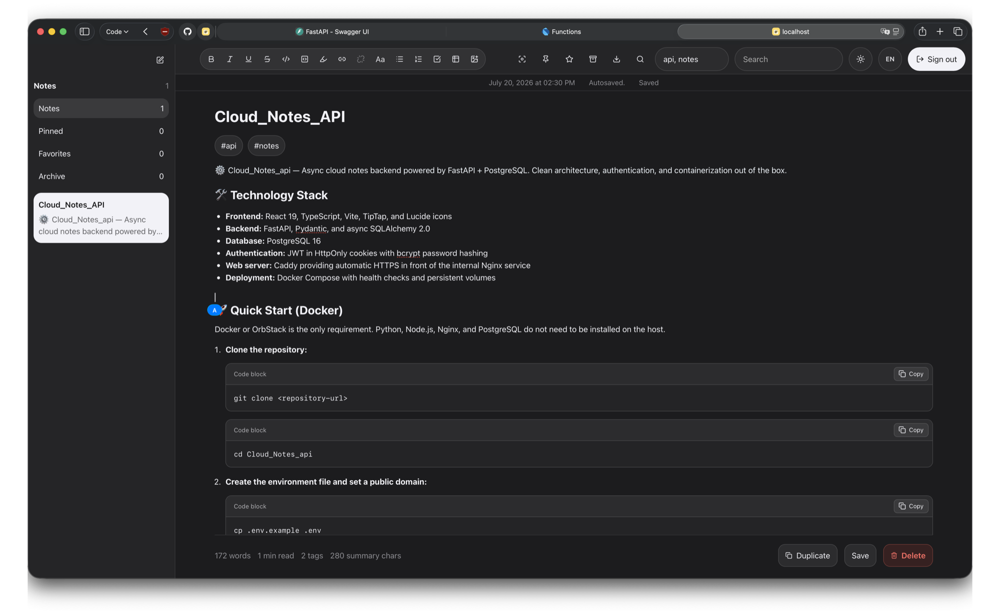
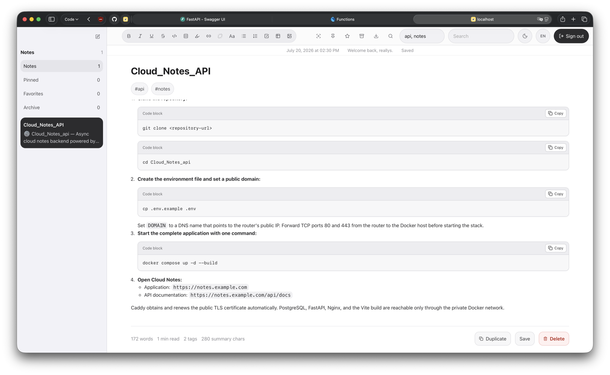

# ⚙️ Cloud Notes

Self-hosted cloud notes with a focused React editor, FastAPI backend, PostgreSQL storage, cookie authentication, image uploads, and English/Russian localization.

---

## 🖥️ Interface

### Dark theme



### Light theme



---

## 🛠️ Technology Stack

[](https://react.dev)
[](https://typescriptlang.org)
[](https://fastapi.tiangolo.com)
[](https://postgresql.org)
[](https://docker.com)
[](https://nginx.org)
[](https://caddyserver.com)

- **Frontend:** React 19, TypeScript, Vite, TipTap, and Lucide icons
- **Backend:** FastAPI, Pydantic, async SQLAlchemy 2.0, and Redis pub/sub
- **Database:** PostgreSQL 16
- **Authentication:** JWT in HttpOnly cookies with bcrypt password hashing
- **Web server:** Caddy providing automatic HTTPS in front of the internal Nginx service
- **Deployment:** Docker Compose with health checks and persistent volumes

## 🚀 Quick Start (Docker)

Docker or OrbStack is the only requirement. Python, Node.js, Nginx, and PostgreSQL do not need to be installed on the host.

1. **Clone the repository:**

   ```bash
   git clone <repository-url>
   cd Cloud_Notes_api
   ```

2. **Create the environment file and set a public domain:**

   ```bash
   cp .env.example .env
   ```

   Set `DOMAIN` to a DNS name that points to the router's public IP. Forward TCP ports 80 and 443 from the router to the Docker host before starting the stack.

3. **Start the complete application with one command:**

   ```bash
   docker compose up -d --build
   ```

4. **Open Cloud Notes:**

   - Application: `https://notes.example.com`
   - API documentation: `https://notes.example.com/api/docs`

Caddy obtains and renews the public TLS certificate automatically. PostgreSQL, Redis, FastAPI, Nginx, and the Vite build are reachable only through the private Docker network.

## 🧪 Local HTTP Testing

Local testing does not require a domain, TLS certificate, router configuration, or a production `.env` file. Start only PostgreSQL, FastAPI, and Nginx with the local override:

```bash
docker compose -f docker-compose.yml -f docker-compose.local.yml up -d --build db server frontend
```

Open:

- Application: `http://localhost:8080`
- API documentation: `http://localhost:8080/api/docs`
- Health check: `http://localhost:8080/api/system/health-check`

To test from another device on the same LAN, replace `localhost` with the Docker host's local IP address:

```text
http://SERVER_LAN_IP:8080
```

The local override sets `COOKIE_SECURE=false` so authentication works over plain HTTP. It publishes only the Nginx frontend; FastAPI and PostgreSQL remain internal Docker services.

Stop the local stack with:

```bash
docker compose -f docker-compose.yml -f docker-compose.local.yml down
```

Set a different local port when 8080 is occupied:

```bash
LOCAL_APP_PORT=9090 docker compose -f docker-compose.yml -f docker-compose.local.yml up -d --build db server frontend
```

---

## ⚙️ Configuration

Create `.env` before the first start:

```bash
cp .env.example .env
```

Recommended settings:

```dotenv
DOMAIN=notes.example.com
POSTGRES_USER=cloud_notes
POSTGRES_PASSWORD=use-a-long-random-password
POSTGRES_DB=cloud_notes
JWT_SECRET_KEY=use-a-random-secret-at-least-32-bytes-long
JWT_EXPIRE_MINUTES=43200
SESSION_MAX_AGE_SECONDS=2592000
COOKIE_SECURE=true
REGISTRATION_ENABLED=true
SQL_ECHO=false
```

- `DOMAIN` must resolve to the router's public IP. Dynamic addresses can be maintained with any compatible DDNS provider.
- `JWT_SECRET_KEY` keeps login sessions valid after backend recreation. Without it, a secure temporary key is generated at every backend start and existing sessions are invalidated.
- `JWT_EXPIRE_MINUTES` controls token lifetime. `43200` is 30 days; `0` explicitly enables non-expiring tokens.
- `SESSION_MAX_AGE_SECONDS` controls the browser cookie lifetime and should match the intended token lifetime.
- `COOKIE_SECURE=true` prevents authentication cookies from being sent over plain HTTP.
- Set `REGISTRATION_ENABLED=false` after creating the required accounts if public registration is not needed.
- Database credentials must be selected before the PostgreSQL volume is initialized. Changing them later does not modify an existing database volume.

Apply configuration changes with:

```bash
docker compose up -d --build
```

Database migrations run automatically before the API starts. To inspect or apply
them manually, use:

```bash
docker compose run --rm server alembic current
docker compose run --rm server alembic upgrade head
```

Create a migration after changing SQLAlchemy models with:

```bash
docker compose run --rm server alembic revision --autogenerate -m "describe change"
```

## ✅ Production Checklist

Before exposing the application to the internet:

1. **Create the local environment file:**

   ```bash
   cp .env.example .env
   ```

2. **Replace every value marked `PRODUCTION` in `.env`:**

   - set a real public `DOMAIN`;
   - choose PostgreSQL credentials before the first database start;
   - generate and preserve a JWT signing key:

     ```bash
     openssl rand -hex 32
     ```

3. **Configure DNS:** point the selected domain to the router's public IP. Configure a DDNS updater if that address changes periodically.

4. **Give the Docker host a fixed LAN address:** use a DHCP reservation or a static network configuration.

5. **Configure router forwarding:**

   - TCP 80 to the Docker host port 80;
   - TCP 443 to the Docker host port 443;
   - UDP 443 to the Docker host port 443 only when HTTP/3 is wanted.

6. **Do not expose internal services:** ports 5432, 8000, and the former development port 8080 must remain closed externally.

7. **Keep secure cookies enabled:** `COOKIE_SECURE=true` is required for the HTTPS deployment.

8. **Restrict account creation:** after creating the intended accounts, consider setting `REGISTRATION_ENABLED=false` and recreating the server container.

9. **Verify certificate issuance:**

   ```bash
   docker compose logs -f caddy
   ```

10. **Test from an external network:** open the configured HTTPS domain over cellular data instead of the server's local Wi-Fi.

11. **Configure backups:** regularly back up both the PostgreSQL data and uploaded attachment volume.

## 🔌 Published Ports

| Service | Container port | Host port | Exposure |
|---|---:|---:|---|
| Caddy HTTP | 80 | `80/tcp` | Public; redirects to HTTPS and handles ACME |
| Caddy HTTPS | 443 | `443/tcp` and `443/udp` | Public HTTPS and HTTP/3 |
| Nginx frontend | 80 | Not published | Docker network only |
| FastAPI backend | 8000 | Not published | Docker network only |
| PostgreSQL | 5432 | Not published | Docker network only |
| Redis | 6379 | Not published | Docker network only |

Do not forward ports 5432, 8000, or the former frontend port 8080 from the router.

---

## 💾 Persistent Data and Backups

Docker volumes preserve both database records and uploaded images:

- `pgdata` stores PostgreSQL data.
- `uploads` stores note attachments.

On upgrade, files from the legacy `backend/uploads` directory are copied into the attachment volume automatically. Existing attachment links that used `localhost:8000` are normalized by the API.

Stop containers without deleting data:

```bash
docker compose down
```

Do not use `docker compose down -v` unless all notes and uploaded images may be permanently deleted.

Create a database backup:

```bash
docker compose exec -T db pg_dump -U admin main_db > cloud-notes-backup.sql
```

When custom PostgreSQL values are configured, replace `admin` and `main_db` in the backup command.

## 🩺 Operations

Check container health and published ports:

```bash
docker compose ps
```

Follow application logs:

```bash
docker compose logs -f caddy frontend server db
```

Restart the stack:

```bash
docker compose restart
```

Update after pulling new code:

```bash
git pull
docker compose up -d --build
```

---

## 📂 Project Structure

```text
Cloud_Notes_api/
├── backend/
│   ├── app/
│   │   ├── api/             # Notes, users, attachments, and health routes
│   │   ├── database.py      # Async SQLAlchemy engine and sessions
│   │   ├── dependencies.py  # Authentication dependencies
│   │   ├── main.py          # FastAPI application and startup lifecycle
│   │   ├── models.py        # User, note, and attachment models
│   │   ├── schemas.py       # Request and response validation
│   │   └── utils.py         # Password hashing and JWT helpers
│   └── Dockerfile
├── frontend/
│   ├── src/                 # React application, styles, API client, and localization
│   ├── Dockerfile           # Vite build and Nginx runtime
│   └── nginx.conf           # Static frontend and `/api` reverse proxy
├── Caddyfile                # Public HTTPS and reverse proxy configuration
├── docker-compose.yml
├── .env.example
└── README.md
```

## 🔒 Security Notes

- Only Caddy ports 80 and 443 are published.
- Authentication cookies are HttpOnly and use `SameSite=Lax`.
- Token and cookie lifetimes are configurable. The production example uses 30 days; signing out invalidates the browser cookie immediately.
- Login attempts are limited per client address.
- Uploaded images are size-limited, streamed to disk, and checked by extension, MIME type, and file signature.
- SQL parameter logging is disabled by default.
- The backend container runs as an unprivileged user.
- Caddy redirects HTTP to HTTPS and manages certificate renewal automatically.
